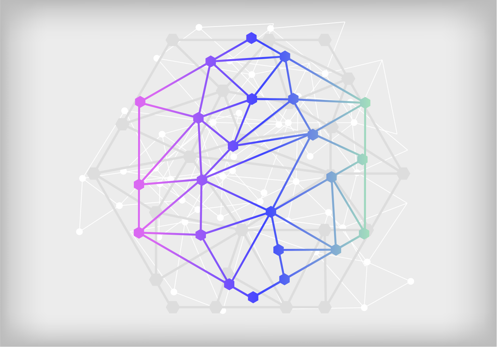

# GraphEx




Image Credit [Network Vectors by Vecteezy](https://www.vecteezy.com/free-vector/network)

**A header-only C++17 graph-based execution model for a network of interlinked tasks. Support passing of arguments between each node task.**

## Sample usage:

### Simple example with sequential tasks
```C++
using namespace GE;
// define the tasks that need to be ran
// below are simple tasks to be run in sequence
// first ----> second ----> third ----> fourth
decltype(auto) first =
    makeNode([]() -> void { std::cout << "Running first\n"; });
decltype(auto) second =
    makeNode([]() -> void { std::cout << "Running second\n"; });
decltype(auto) third =
    makeNode([]() -> void { std::cout << "Running third\n"; });
decltype(auto) fourth =
    makeNode([]() -> void { std::cout << "Running fourth\n"; });

second.setParent(first);
third.setParent(second);
fourth.setParent(third);
GraphEx executor(1); // set maximum number of concurrent threads running at the same time

executor.registerInputNode(&first); // register the entry points for the graph. Can be multiple
EXPECT_FALSE(executor.hasCycle()); // Check if the dependency graph has cycle
executor.execute();

/**
Running first
Running third
Running second
Running fourth
*/
```

### Example with graph with argument passing between nodes
```C++
decltype(auto) first =
    makeNode([]() -> void { std::cout << "Running first\n"; });

// create a function that doesn't take in anything and return 1
std::function<int(void)> secondFunc = []() -> int {
    std::cout << "Running second\nReturn 1\n";
    return 1;
};
decltype(auto) second = makeNode(secondFunc);

// create a function that takes in a number and return number + 2
std::function<int(int)> thirdFunc = [](int a) -> int {
    std::cout << "Running third\nAdding 2: a + 2 == " << a + 2 << "\n";
    return a + 2;
};
decltype(auto) third = makeNode(thirdFunc);

std::function<int(int)> fourthFunc = [](int a) -> int {
    std::cout << "Running fourth\nMultiplying by 2: a * 2 == " << a * 2
                << "\n";
    return a * 2;
};
decltype(auto) fourth = makeNode(fourthFunc);

std::function<int(int, int)> fifthFunc = [](int a, int b) -> int {
    std::cout << "Running fifth\nModding the two numbers: a % b == "
                << a % b << "\n";
    return a % b;
};
decltype(auto) fifth = makeNode(fifthFunc);

second.setParent(first);
third.setParent<0>(second);
fourth.setParent<0>(second);
fifth.setParent<0>(third);
fifth.setParent<1>(fourth);

// The data flow in graph above can be visualize as followed:
//        void           int                  int
// first ------> second ------->   third   -------->    fifth
//                 |     int                  int         |
//                 ------------>   fourth  -------------->
GraphExOptions opt;
GraphEx executor(opt);
executor.registerInputNode(&first);
EXPECT_FALSE(executor.hasCycle());

/// mark the nodes as output to confirm the results later
third.MarkAsOutput();
fourth.MarkAsOutput();
fifth.MarkAsOutput();

executor.execute();
// Check the result obtained from the nodes
EXPECT_EQ(third.Collect(), 3);
EXPECT_EQ(fourth.Collect(), 2);
EXPECT_EQ(fifth.Collect(), 1);
/**
Running first
Running second
Return 1
Running third
Adding 2: a + 2 == 3
Running fourth
Multiplying by 2: a * 2 == 2
Running fifth
Modding the two numbers: a % b == 1
*/
```


### Check if a dependency graph has cycle
```C++
decltype(auto) first =
    makeNode([]() -> void { std::cout << "Running first\n"; });
decltype(auto) second =
    makeNode([]() -> void { std::cout << "Running second\n"; });
decltype(auto) third =
    makeNode([]() -> void { std::cout << "Running third\n"; });
decltype(auto) fourth =
    makeNode([]() -> void { std::cout << "Running fourth\n"; });
second.setParent(first);
third.setParent(second);
fourth.setParent(third);
first.setParent(fourth);
GraphEx executor;
executor.registerInputNode(&first);
EXPECT_TRUE(executor.hasCycle()); // 1 -> 2 -> 3 -> 4 -> 1
```

### Usable with a wide range of `ReturnType`
```C++
using NonCopyableType = std::unique_ptr<int>;
std::function<NonCopyableType()> firstFunc = []() -> NonCopyableType {
    return std::make_unique<int>(10);
};
decltype(auto) first = makeNode(firstFunc);
std::function<NonCopyableType(NonCopyableType)> secondFunc =
    [](NonCopyableType a) -> NonCopyableType {
    *a = 6;
    return a;
};
decltype(auto) second = makeNode(secondFunc);
second.setParent<0>(first);
second.MarkAsOutput();
GraphEx executor;
executor.registerInputNode(&first);
executor.execute();
std::cout << "Done running\n";
auto finalOutput = second.Collect();
EXPECT_EQ(*finalOutput, 6);
```

### Create Node from struct/class method
```C++
struct Foo {
    auto first() -> int { return 4; }
    auto second(int x) -> int { return x * 2; }
};

Foo foo;
std::function<int(void)> firstFunc = std::bind(&Foo::first, &foo);
decltype(auto) first = makeNode(firstFunc);

std::function<int(int)> secondFunc =
    std::bind(&Foo::second, &foo, std::placeholders::_1);
decltype(auto) second = makeNode(secondFunc);

second.setParent<0>(first);
second.MarkAsOutput();
GraphEx executor;
executor.registerInputNode(&first);
executor.execute();

EXPECT_EQ(second.Collect(), 8);
```

## Installation
There are 2 variants of thread pools, one with Boost lockess queue. To use Boost lockless queue version, compile
your program with `USE_BOOST_LOCKLESS_Q`. Do some benchmarking to see which is more optimal for your process.
After that, simply include `cptl.hpp` or `cptl_stl.hpp` and `graphex.hpp` in your project and make sure build the project with C++17-compatible compiler.


## Development
The project is still under development and still too early for any usage.

You'll need the following packages:
1. CMake (>= 3.12) with Ninja build system (1.9.0)
2. Boost (1.67.0)
3. benchmark (1.5.0)
4. GTest (1.8.0)

- To build the tests `./build.sh -b`
- To run the tests `./build.sh -rt` or `./build/graph_test`
- To run the benchmark `./build.sh -bm` or `./build/bmark`

### TODO
- [x] Add concurrency to tasks execution
- [ ] Optimize further

## Contribute
### Current contributors
[Truong Giang](https://github.com/heiseish) and
[Minh Phuc](https://github.com/le-minhphuc).


We welcome contributions! Any PR is welcome.

## Feedback
For any feedback or to report a bug, please file a [GitHub Issue](https://github.com/heiseish/graphex/issues).

***
# License
[MIT License](LICENSE)